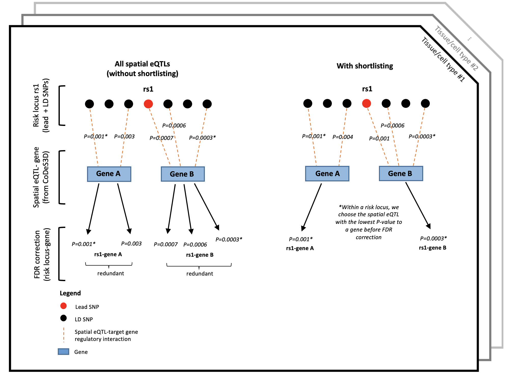

This repository contains the python scripts used for generating the shortlisted CoDeS3D results for the manuscript "Juvenile idiopathic arthritis-associated genetic loci exhibit spatially constrained gene regulatory effects across multiple tissues and immune cell types". This study combined multiple levels of biological information (3D genome organization [Hi-C] and tissue/cell type-specific eQTL data) to decipher the biological mechanism linking genetic risk to the development of JIA.

The statistical rationale behind this "shortlisting" step is explained in Supplementary Figure 3 in the manuscript

In this repository, the "Scripts" folder contains two Python scripts.

1. The first Python script "shortlisting_script.py" takes in three CoDeS3D output files (eqtls.txt, genes.txt, snps.txt), and one csv file of risk locus/LD grouping as the input (see "risk_locus_grouping.csv" file or supplementary table 3 for examples), this script outputs two files :

A). The first output file "significant_eqtls_shortlisted.txt" is a tab-separated file containing spatial eQTL-target gene interactions after shortlisting that passed the FDR correction

B). The second output file "eqtls_shortlisted.txt" is a tab-separated file containing spatial eQTL-target gene interactions after shortlisting that have not been filtered for FDR less than 0.05 

example usage command : "python shortlisting_script.py -e eqtls.txt -g genes.txt -s snps.txt -l risk_locus_grouping.csv"

note :  use "python shortlisting_script.py -h" to access help page

2. However, in the output file "significant_eqtls_shortlisted.txt" , the effect size of each spatial eQTL-target gene interactions is reported with beta value, not allelic fold change (log2[aFc]). In order to get the effect size in term of allelic fold change, we need to use the second python script "summary.py".

the script "summary.py" takes the second output file of the script "shortlisting_script.py" called "eqtls_shortlisted.txt" as the input. Note that in order for "summary.py" to work properly, it must be in the same folder with the CoDeS3D output files "genes.txt" and "snps.txt". The script "summary.py" will output "significant_eqtls.txt" which is a tab-separated file containing spatial eQTL-target gene interactions after shortlisting that passed the FDR correction (effect size is reported using (log2 [aFc]))

example usage command : "python summary.py -e eqtls_shortlisted.txt --eqtl-project GTEx --multi-test tissue -o summary_py_results"

note : the "--multi-test tissue" argument is to make sure that the FDR correction is done separately in each tissues. use "python summary.py -h" to access help page.
